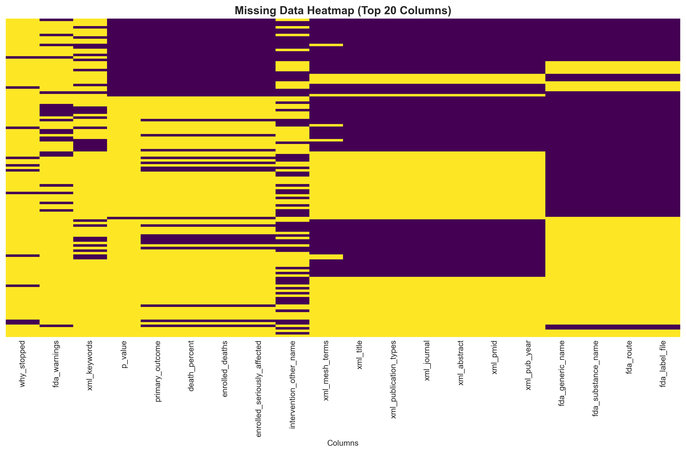
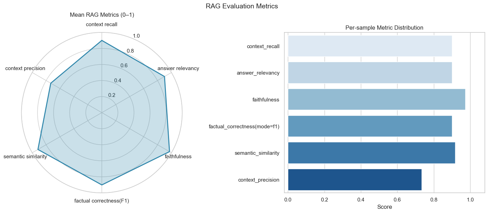
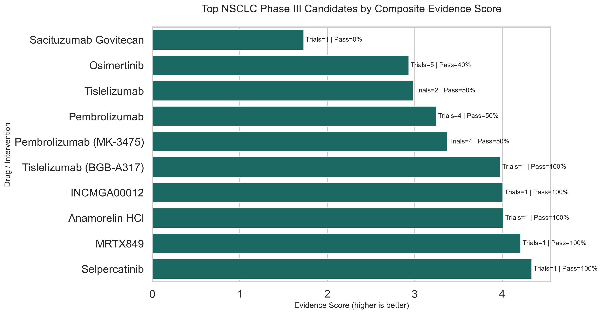
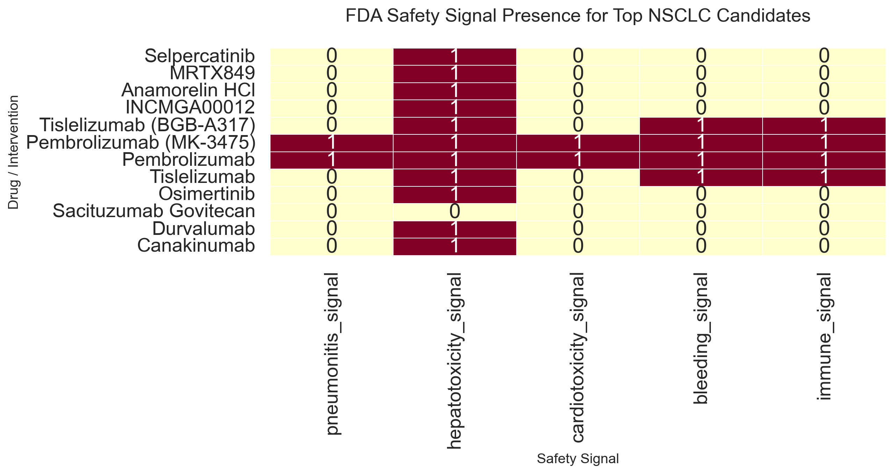

# 🧬 ai-clinical-trials-rag — Phase III Clinical Trials RAG Portfolio

End-to-end Retrieval‑Augmented Generation (RAG) pipeline for extracting, grounding, and answering clinical‑trial questions and predicting Phase III trial outcomes using multi‑source clinical data. This repository demonstrates data engineering, semantic chunking, vector search (Chroma), LLM prompting/chaining (OpenRouter by default), and a defensible ground‑truth workflow — designed as a data‑science / AI RAG project focused on biotech.

## Highlights
- Lightweight RAG stack: section‑aware chunking, OpenRouter/Qwen embeddings (fallbacks supported), Chroma vectorstore, hybrid retrieval + reranking, and LLM answer‑drafting + refinement.
- Example dataset: master clinical trials dataset (127 Phase III trials) and a RAG‑ready subset for retrieval experiments.
- Reproducible notebooks that walk through data loading, ingestion, and retrieval/ground‑truth construction.

See `src/biotech_rag/` for implementation details and `notebooks/` for the guided experiments.

---

## Project Goal

Provide a reproducible, production‑minded RAG pipeline that:
- Ingests multi‑source clinical trial materials (AACT metadata, PubMed XML, PMC PDFs, FDA labels).
- Performs section‑aware chunking and metadata preservation for precise citations.
- Indexes semantic embeddings into a persistent Chroma vectorstore for fast lookup.
- Runs a defensible ground‑truth pipeline (extractive draft → human review → refined answers) to produce evaluation‑grade annotations.

This repo is intended as to showcase data engineering, retrieval systems, and LLM orchestration in a scientific domain (biotech/clinical trials).

---

## Data Sources & Key Files

- Primary sources: AACT (ClinicalTrials.gov) metadata, PubMed / PMC publications (XML & PDFs), and FDA drug labels (JSON).
- Notable processed files (stored under `data/processed/`):
  - `master_ai_trials_dataset.csv` — master table (~127 trials × ~53 columns) with target `success_flag` and `data_richness_score`.
  - `rag_ready_trials.csv` — subset of trials with PDFs/XML available for RAG (~70–75 trials depending on preprocessing).
  - `dataset_summary.json` — dataset stats and creation metadata.
  - `ground_truth_template.csv` — sample question template used to build ground truth (200 rows in the demo template).

Practical notes from the current run:
- Vectorstore (Chroma) contains 5,532 indexed chunks (PDF ≈ 1,411; PubMed XML ≈ 305; FDA labels ≈ 3,816).
- Embedding dimension observed with the default embedder: 4096 (OpenRouter Qwen embedding in this demo).

---

## Notebooks (run in order)

- [notebooks/01_clinical_data_loading.ipynb](notebooks/01_clinical_data_loading.ipynb) — Data loading & inspection
  - Loads the master dataset and RAG‑ready subset, prints schema and summary stats, and documents dataset characteristics (missingness, class imbalance, richness score).
  - Useful artifacts: confirms `master_ai_trials_dataset.csv` (127 trials) and `rag_ready` counts.

  | Missing data heatmap |
  |:---:|
  |  | 

- [notebooks/02_ingest_to_chroma.ipynb](notebooks/02_ingest_to_chroma.ipynb) — Document parsing, chunking, embedding, and upsert
  - Section‑aware PDF parsing, PubMed XML parsing, and FDA JSON parsing.
  - Uses `HybridScientificChunker` to create semantically coherent chunks with overlap and strong metadata (filename, page, section_title, nct_id, pmid).
  - Embeddings are produced by the centralized `Embedder` (OpenRouter/Qwen first, with local fallback) and persisted into Chroma at `data/processed/vectorstore/chroma_db`.
  - Output example: ingestion totals and a sample collection preview (documents + metadata).

- [notebooks/03_retrieval_strategies.ipynb](notebooks/03_retrieval_strategies.ipynb) — Retrieval, ground truth, and LLM drafting
  - Builds a defensible ground‑truth pipeline: retrieve top‑K (K=5) chunks per question, draft extractive answers with citations (Draft 1), support human review and refinement (Draft 2 → final JSON).
  - Implements hybrid retrieval options (dense embeddings + BM25) and supports reranking (cross‑encoder) for evaluation experiments.
  - Produces artifacts such as `retrieved_contexts.json`, `draft1_answers.json`, and downstream ground‑truth JSONs.

- [notebooks/04_rag_evaluation.ipynb](notebooks/04_rag_evaluation.ipynb) — RAGAS evaluation and judge-model scoring
  - Evaluates retrieval and generation quality with RAGAS metrics using an OpenRouter judge model (`openai/gpt-4o-mini:floor`).
  - Builds an evaluation set from retrieved contexts, draft answers, and final ground truth.
  - Produces `data/processed/ragas_results.json` with per-row scores and aggregate summaries.

- [notebooks/05_RAG_extraction.ipynb](notebooks/05_RAG_extraction.ipynb) — NSCLC extraction dashboard and drug ranking
  - Runs clinician-oriented Q&A for Phase III NSCLC and generates concise answer cards.
  - Builds a composite evidence ranking of candidate therapies and augments each candidate with FDA safety signals from vectorstore retrieval.
  - Produces extraction artifacts in `data/processed/extractions/`, including ranking and safety summaries.

### Notebook 04 Metrics Summary (RAGAS)

Source: `data/processed/ragas_results.json` (`summary` block; sample size used in notebook: 10).

| Metric | Score |
|---|---:|
| Context Precision | 0.733 |
| Context Recall | 0.900 |
| Answer Relevancy | 0.900 |
| Faithfulness | 0.972 |
| Factual Correctness (F1) | 0.901 |
| Semantic Similarity | 0.918 |

Interpretation:
- The pipeline shows strong grounding quality (`faithfulness=0.972`) and high overall answer alignment (`factual_correctness=0.901`, `semantic_similarity=0.918`).
- Retrieval recall is strong (`0.900`), while precision (`0.733`) indicates remaining room to reduce noisy context.



### Notebook 05 Candidate Summary (Phase III NSCLC)

Source: `data/processed/extractions/nsclc_phase3_drug_ranking.csv` (top rows by `evidence_score`).

| Rank | Drug | Trial Count | Median p-value | Promising Rate | Evidence Score |
|---:|---|---:|---:|---:|---:|
| 1 | Selpercatinib | 1 | 0.0002 | 100% | 4.341 |
| 2 | MRTX849 | 1 | 0.0001 | 100% | 4.216 |
| 3 | Anamorelin HCl | 1 | 0.0001 | 100% | 4.016 |
| 4 | INCMGA00012 | 1 | 0.0042 | 100% | 4.010 |
| 5 | Tislelizumab (BGB-A317) | 1 | 0.0054 | 100% | 3.983 |

Conclusion:
- In this current extraction run, the strongest Phase III NSCLC candidates by the notebook's composite evidence heuristic are Selpercatinib, MRTX849, and Anamorelin HCl.
- These rankings are a prioritization signal for further review by clinicians, not standalone medical recommendations; they should be interpreted with the associated safety evidence and protocol-level context.

| Promising candidates | 
|:---:|
|  |

| FDA safety signals |
|:---:|
|  |
---

## Quick Start (developer)

1. Create a virtual environment and install dev dependencies:

   ```bash
   python -m pip install --upgrade pip
   pip install -e ".[dev]"
   ```

2. Provide API keys in a `.env` file for optional remote LLM/embedding providers (e.g. `OPENROUTER_API_KEY`, `OPENROUTER_BASE_URL`). The code falls back to local models when keys are missing.

3. Launch Jupyter and run notebooks in sequence: 01 → 02 → 03 → 04 → 05. Notebooks include diagnostic cells and example outputs to verify ingestion, retrieval, evaluation, and extraction.

---

## Implementation notes & caveats

- The demo uses OpenRouter/Qwen embedding by default (embedding dim 4096). For reproducibility, lock the same embedding model at ingestion and query time or reindex if you change the model.
- The ingestion pipeline detects duplicate chunk IDs and deduplicates batches before upsert.
- Find the core code under `src/biotech_rag/` and the notebooks under `notebooks/`.
